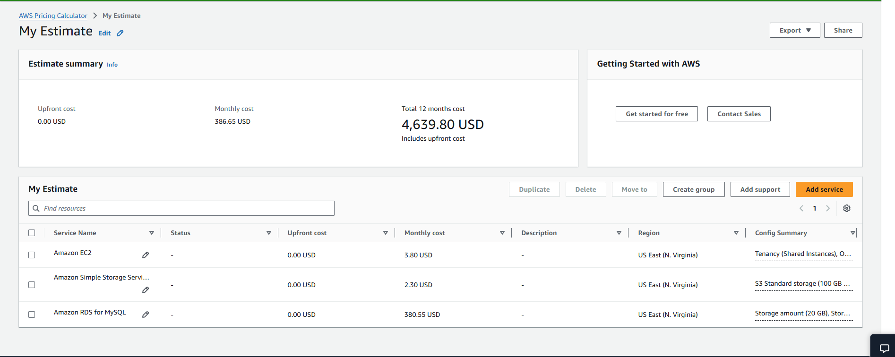

# Exploring AWS Services Lab - Solution

**Student Name:** Theo Boyesen
**Date Completed:** 2.2.26

---

## Exercise 1: Console Navigation

### Part A: Service Discovery

**EC2 (Compute):**
- Purpose: Lets you run virtual servers on AWS
- Screenshot: 

**S3 (Storage):**
- Purpose: Where you can safely store files in the cloud on AWS in buckets.
- Screenshot: 

**RDS (Database):**
- Purpose: Yo dyotr important organised information (users, passwords, orders, messages, settings)
- Screenshot: 

**VPC (Networking):**
- Purpose: To give a private, secure network to control how AWS resources communicate
- Screenshot: 

**IAM (Security):**
- Purpose: Controls who can do what in an AWS account
- Screenshot: 

### Part B: Console Features

**Lambda Category:** Compute / SaaS

**Pinned Services:**


**Recently Visited:**


**Region Selector:**

- Original region: [region]
- Changed to: [region]
- Changed back: [Yes/No]

---

## Exercise 2: Service Categorization

### Completed Service Matrix:

| Category | Services | Primary Use Case |
|----------|----------|------------------|
| Compute | EC2, Lambda, Elastic Beanstalk | EC2 (hosting a backend API or web app), Lambda (processing a file upload), Elastic beanstalk (deploy an app just by uploading code)
| Storage | [S3, EBS, EFS] | S3 (Storing + serving files), EBS (Storing data a server needs to keep if restarts), EFS (Shared network file system)
| Database | RDS, DynamoDB, ElastiCache | Managing data
| Networking | VPC, CloudFront, Route 53 | Connecting resources
| Security | IAM, KMS, CloudTrail | Securing resources
| Management | CloutWatch, CloudFormation, Systems Manager | Monitoring & Automation

### Research Question Answers:

**1. What's the difference between EC2 and Lambda?**

EC2 is server based compute where you manage the machine, while Lambda is serverless compute where AWS runs your code on demand

---

**2. When would you use S3 vs EBS?**

Use S3 for scalable, durable file storage, and use EBS for persistent disk storage attached to EC2 instances.

---

**3. What's the difference between RDS and DynamoDB?**

RDS is a relational SQL database for structured data and complex queries, while DynamoDB is a serverless NoSQL database built for massive scale and fast key-value access.

---

**4. Why do you need a VPC?**

You need a VPC so your AWS resources live in a private, secure network that you control.

---

**5. What does CloudWatch monitor?**

CloudWatch monitors AWS resources and applications by collecting metrics, logs, and events, and triggering alarms when thresholds are breached.

---

## Exercise 3: AWS CLI

### CLI Version:
```
aws-cli/2.33.11 Python/3.13.11 Windows/11 exe/AMD64
```

### Configuration:
```
NAME       : VALUE                    : TYPE             : LOCATION
profile    : <not set>                : None             : None
access_key : ****************7T6T     : shared-credentials-file :
secret_key : ****************/05A     : shared-credentials-file :
region     : eu-west-2                : config-file      : ~/.aws/config
```

### CLI Outputs:

See attached `cli-outputs.txt` file for all command outputs.

**Key findings:**
- My AWS Account ID: 369073368965
- Default region: eu-west-2
- Number of regions available: 16

---

## Exercise 4: Pricing Research

### Pricing Worksheet:

**1. EC2 t3.micro (Linux, us-east-1):**
- On-Demand: $0.0104per hour
- Monthly (730 hours): $3.80
- Free Tier eligible: No
- Free Tier details: 12 months

**2. S3 Standard Storage:**
- 100 GB monthly cost: $2.30
- Free Tier: First 5GB free for 12 months
- Cost per GB: $0.023

**3. RDS db.t3.micro (MySQL):**
- Monthly cost: $380.55
- Free Tier eligible: Yes

**4. Data Transfer OUT:**
- 100 GB cost: $9
- First 100GB free per month

### AWS Pricing Calculator Estimate:



**Estimate Link:** [Paste your estimate link here]

**Total Estimated Monthly Cost:** $386.65

---

## Exercise 5: Documentation Hunt

### EC2 Instance Types:
- Documentation URL:][](https://docs.aws.amazon.com/AWSEC2/latest/UserGuide/instance-types.html)
- t3.medium vCPUs: 2
- t3.medium memory: 4 GB

### S3 Storage Classes:
- Documentation URL: (https://docs.aws.amazon.com/AmazonS3/latest/userguide/storage-class-intro.html)
- All storage classes:
  1. S3 Standard
  2. S3 Intelligent-Tiering
  3. S3 Standard-IA
  4. S3 One Zone-IA
  5. S3 Glacier Instant Retrieval
  6. S3 Glacier Flexible Retrieval
  7. S3 Glacier Deep Archive

- Cheapest for archive: S3 Glacier Deep Archive

### IAM Best Practices:
- Documentation URL: https://docs.aws.amazon.com/IAM/latest/UserGuide/best-practices.html
- Three best practices:
  1. [Enable multi-factor authentication (MFA) for all users, especially the root account
  2. Follow the principle of least privilege (only grant permissions that are required)
  3. Use IAM roles instead of long-term access keys whenever possible

### Free Tier Limits:
- Documentation URL: https://aws.amazon.com/free/
- EC2 t2.micro hours/month: 750
- S3 storage free: 5GB

---

## Exercise 6: Regions and Availability Zones

### Your Current Region:
- Region Name: US East (N. Virginia)
- Region Code: us-east-1
- Number of AZs: 6

### Concept Questions:

**What is the difference between a Region and an Availability Zone?**

A Region is a geographic area where AWS has data centres. An Availability Zone is a physically separate data centre inside a Region.

---

**Why does AWS have multiple regions?**

Serve users globally, stay reliable, and meet legal requirements

---

**How many Availability Zones does each region typically have?**

3

---

**Can you deploy resources in multiple regions simultaneously?**

Yes

---

### Region Selection Analysis:

| Scenario | Best Region | Reasoning |
|----------|-------------|-----------|
| Serving users primarily in Europe | EU West (Ireland) | Central location = Low latency
| Lowest cost for non-critical workloads | US East (N. Virginia ) | Oldest & largest AWS region
| GDPR compliance required | EU West (Ireland) | AWS regions in the EU are GDPR aligned when you configure services correctly
| Serving users in Asia-Pacific | Asia Pacific (Singapore) | Central location but should be deployed in nearest AWS region
| Need newest AWS services | US East (N. Virginia ) | This region is the first to recieve new AWS services 

---

## Bonus Challenges

### Challenge 1: Cost Estimate

**Architecture:**
- 1x t3.medium EC2 (24/7)
- 1x db.t3.micro RDS (24/7)
- 50 GB S3
- 100 GB data transfer

**Estimated Monthly Cost:** $______

**Calculator Link:** [URL]

---

### Challenge 2: Service Comparison

| AWS | Azure | GCP |
|-----|-------|-----|
| EC2 | [Azure service] | [GCP service] |
| S3 | [Azure service] | [GCP service] |
| RDS | [Azure service] | [GCP service] |
| Lambda | [Azure service] | [GCP service] |

---

### Challenge 3: CLI Advanced

[Paste outputs of advanced commands here]

---

## Reflection

**What surprised you most about AWS services?**

[Your answer]

---

**Which AWS service are you most excited to learn about?**

[Your answer]

---

**How comfortable do you feel navigating the AWS Console now?**

[Your answer: Scale 1-10 and why]

---

## Checklist

- [ ] All service dashboards visited and documented
- [ ] All CLI commands executed successfully
- [ ] All pricing research completed
- [ ] All documentation URLs found
- [ ] Region analysis completed
- [ ] All screenshots captured
- [ ] All questions answered
- [ ] Work committed to Git
- [ ] Pull request created

---

**Completed By:** [Your Name]  
**Date:** [Date]
